<picture>
  <source media="(prefers-color-scheme: dark)" srcset="./banner-dark-animated.svg">
  
</picture>

 

I build software and machine learning systems, and I'm most interested in the places they fail. Right now that means multi-agent research, security tooling, and writing about how language models break.

---

#### Selected work

**[The Sandbox](https://github.com/USERNAME/REPO)** — A multi-agent environment for social deduction games, used to study deception, coalition-forming, and theory of mind in LLM agents. Research in progress.
`Python` · `LLM agents` · `evaluation`

**[Foxtrot](https://github.com/USERNAME/REPO)** — Financial fraud detection over transaction networks, combining NLP over transaction text with sequence models and a graph backend.
`LangChain` · `LSTM` · `Neo4j`

**[Multimodal music discovery](https://github.com/USERNAME/REPO)** — Recommends music from images and free-text mood descriptions by grounding a vision-language model against the Spotify catalog.
`Llama 3.3 70B` · `Groq` · `Spotify API`

**[Project name](https://github.com/USERNAME/REPO)** — One line on what it does and why it's interesting.
`Tool` · `Tool` · `Tool`

---

#### Writing

- [Prompt injection and the limits of LLM guardrails](LINK) — Medium
- Two papers at ICETCSE 2025

---

#### Tools

Python · R · SQL · PyTorch · scikit-learn · XGBoost · LangChain · Neo4j · Postgres · Docker · AWS

---

#### Away from the keyboard

Usually at a different keyboard — the one with black and white keys. The rest goes to paint, photographs, and a coffee habit I've stopped defending.

---

